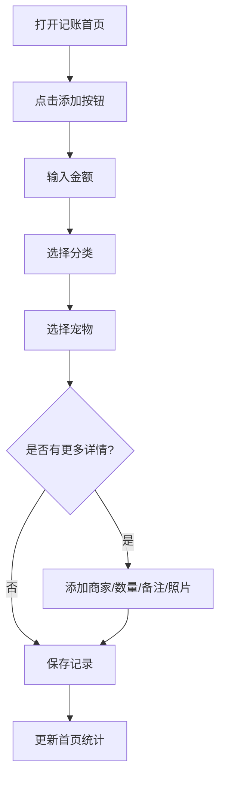
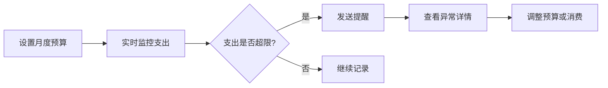

# 宠物消费分析小程序 - 产品需求文档

## 1. 产品概述

一款面向养猫养狗的个人主人的宠物消费记录与分析工具，帮助用户追踪日常养宠支出、分析消费趋势、合理规划预算。

**核心价值**：让宠物主人清晰了解"毛孩子"的花销去向，通过数据洞察优化养宠成本，提升财务规划能力。

---

## 2. 核心功能

### 2.1 主要页面

1. **记账首页** - 快速记账、支出概览、本月统计
2. **分类明细** - 按品类查看消费明细与趋势
3. **月度报表** - 月度消费汇总、对比分析、趋势图
4. **预算提醒** - 预算设置、超支提醒、异常预警
5. **物品清单** - 常购物品管理、均价对比、库存提醒

### 2.2 记账功能

- **快速记账**：金额 + 分类 + 宠物，一键录入
- **支出分类**：食品、医疗、美容、玩具、寄养五大类
- **宠物管理**：支持多宠物，为每笔支出分配宠物
- **详细信息**：商家名称、商品数量、备注说明
- **票据上传**：拍照或相册选择，保存消费凭证
- **固定开销**：设置每月自动生成的固定支出（如定期疫苗、体检）

### 2.3 分析功能

- **趋势查看**：按月、按品类、按宠物多维度分析
- **对比视图**：月度环比、同比对比
- **异常检测**：自动识别超出常规的支出项目
- **均价对比**：同类商品历史价格对比，帮用户了解价格波动

### 2.4 提醒功能

- **预算提醒**：设置月度/品类预算，超出自动提醒
- **到期提醒**：疫苗接种、驱虫、体检等重要日期提醒
- **异常提醒**：单笔支出超过品类平均值 200% 时提醒

### 2.5 导出功能

- **消费汇总导出**：生成 Excel/PDF 格式的消费报告
- **数据备份**：支持数据导入导出，防止丢失

---

## 3. 核心流程

### 3.1 记账流程

### 3.2 预算管理流程

---

## 4. 用户界面设计

### 4.1 设计风格

**风格定位**：温暖治愈 + 专业简洁

- **配色方案**：
  - 主色：柔和的薄荷绿 `#98D8C8`（代表宠物可爱、清洁）
  - 辅助色：暖橙色 `#FFB347`（活力、温暖）
  - 强调色：珊瑚粉 `#FF6B6B`（提醒、警示）
  - 背景色：米白色 `#FFF9F0`（温馨、舒适）
  - 文字色：深灰 `#2D3436`（清晰可读）

- **按钮风格**：圆角卡片式按钮，柔和阴影
- **字体**：使用圆润可爱的无衬线字体
- **布局**：卡片式布局，清晰的视觉层次
- **图标**：宠物主题图标，可爱圆润风格
- **动画**：平滑过渡，友好微交互

### 4.2 页面设计

#### 4.2.1 记账首页

| 模块 | UI元素 | 说明 |
|------|--------|------|
| 本月统计卡片 | 圆形进度环 + 金额数字 | 显示本月消费占预算比例 |
| 快捷记账按钮 | 悬浮按钮 FAB | 点击展开快速记账表单 |
| 最近记录列表 | 卡片列表 | 显示最近 5 条消费记录 |
| 宠物切换器 | 头像 + 名称 | 切换查看不同宠物的消费 |
| 快捷分类入口 | 图标网格 | 5 大分类快速入口 |

#### 4.2.2 分类明细页

| 模块 | UI元素 | 说明 |
|------|--------|------|
| 分类筛选器 | 横向滚动标签 | 按分类筛选消费记录 |
| 品类占比图 | 环形图 | 可视化各类别消费占比 |
| 明细列表 | 时间轴 + 卡片 | 按时间展示消费明细 |
| 趋势切换 | 月/周视图切换器 | 切换查看维度 |

#### 4.2.3 月度报表页

| 模块 | UI元素 | 说明 |
|------|--------|------|
| 月份选择器 | 左右箭头 + 月份显示 | 切换不同月份 |
| 总消费柱状图 | 柱状图 | 显示每日/每周消费趋势 |
| 对比卡片 | 同比/环比数据 | 与上期对比分析 |
| TOP消费 | 排行榜样式 | 显示消费最高的项目 |
| 导出按钮 | 下载图标 | 导出当前月报表 |

#### 4.2.4 预算提醒页

| 模块 | UI元素 | 说明 |
|------|--------|------|
| 预算设置卡片 | 滑动条 + 输入框 | 设置月度预算金额 |
| 分类预算 | 多个进度条 | 分品类设置预算上限 |
| 超支警告 | 红色警示卡片 | 突出显示超支项 |
| 到期提醒列表 | 日历视图 | 显示疫苗、驱虫等到期时间 |
| 异常消费列表 | 高亮卡片 | 显示异常高额支出 |

#### 4.2.5 物品清单页

| 模块 | UI元素 | 说明 |
|------|--------|------|
| 常购物品列表 | 卡片 + 均价值 | 展示常购商品及均价 |
| 添加物品按钮 | 悬浮按钮 | 添加新的常购物品 |
| 均价对比图 | 折线图 | 显示价格历史走势 |
| 库存提醒 | 标签 | 设置低库存提醒阈值 |
| 最近购买记录 | 时间线 | 显示最近购买情况 |

### 4.3 响应式设计

- **桌面端**：左侧导航 + 右侧内容区，最大宽度 1200px
- **平板端**：顶部导航 + 卡片网格布局
- **移动端**：底部导航栏 + 单列卡片流
- **触摸优化**：按钮点击区域 ≥ 48px

---

## 5. 数据结构

### 5.1 宠物信息

| 字段 | 类型 | 说明 |
|------|------|------|
| id | UUID | 宠物唯一标识 |
| name | String | 宠物名称 |
| type | Enum | 猫/狗 |
| avatar | String | 宠物头像 |
| created_at | Date | 添加时间 |

### 5.2 消费记录

| 字段 | 类型 | 说明 |
|------|------|------|
| id | UUID | 记录唯一标识 |
| amount | Decimal | 消费金额 |
| category | Enum | 分类（食品/医疗/美容/玩具/寄养） |
| pet_id | UUID | 所属宠物 |
| merchant | String | 商家名称 |
| quantity | Number | 数量 |
| remark | String | 备注说明 |
| receipt | String | 票据照片路径 |
| is_fixed | Boolean | 是否为固定开销 |
| created_at | Date | 消费日期 |
| updated_at | Date | 更新时间 |

### 5.3 物品清单

| 字段 | 类型 | 说明 |
|------|------|------|
| id | UUID | 物品唯一标识 |
| name | String | 物品名称 |
| category | Enum | 所属分类 |
| avg_price | Decimal | 均价 |
| last_price | Decimal | 最近购买价格 |
| stock_count | Number | 库存数量 |
| remind_threshold | Number | 提醒阈值 |
| created_at | Date | 创建时间 |

### 5.4 预算设置

| 字段 | 类型 | 说明 |
|------|------|------|
| id | UUID | 设置唯一标识 |
| month | Date | 预算月份 |
| total_budget | Decimal | 总预算 |
| category_budgets | JSON | 分品类预算 |
| created_at | Date | 创建时间 |

### 5.5 到期提醒

| 字段 | 类型 | 说明 |
|------|------|------|
| id | UUID | 提醒唯一标识 |
| pet_id | UUID | 关联宠物 |
| type | Enum | 疫苗/驱虫/体检/其他 |
| next_date | Date | 下次到期日期 |
| remind_days | Number | 提前提醒天数 |
| created_at | Date | 创建时间 |

---

## 6. 提醒规则

### 6.1 预算提醒

- 当月度消费超过总预算 80%：发送黄色提醒
- 当月度消费超过总预算 100%：发送红色超支警告
- 当某分类消费超过分类预算 100%：该分类高亮警示

### 6.2 异常消费检测

- 单笔支出超过该分类过去 3 个月平均值的 200%：标记为异常
- 异常消费在列表中以特殊样式展示

### 6.3 到期提醒

- 提前 7 天、3 天、1 天分别提醒
- 到期当天发送当日提醒
- 已过期但未处理的提醒持续显示

---

## 7. 导出功能

### 7.1 导出格式

- **Excel (.xlsx)**：包含汇总表、明细表、图表数据
- **PDF**：格式化的月度报告，适合打印分享

### 7.2 导出内容

- 消费汇总（按月/按品类/按宠物）
- 明细记录列表
- 趋势图表
- 预算执行情况
- 导出日期和时间戳
