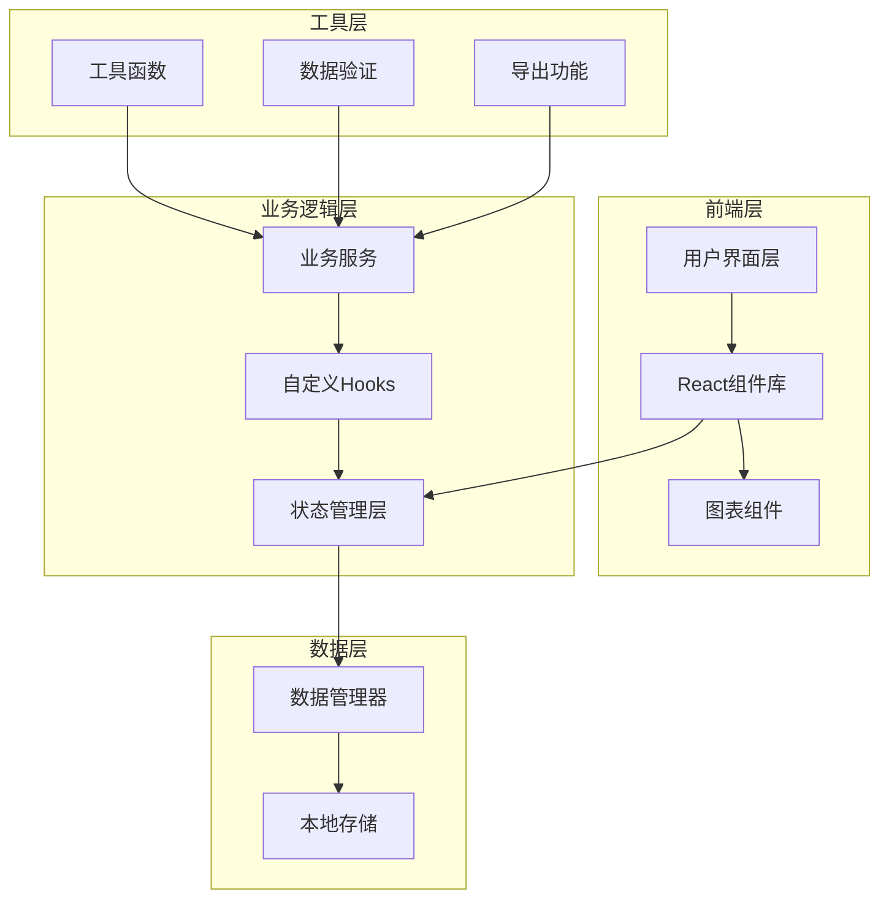

# 宠物消费分析小程序 - 技术架构文档

## 1. 架构设计

### 1.1 系统架构图



### 1.2 技术栈选型

- **框架**：React 18 + Vite
- **样式**：Tailwind CSS
- **路由**：React Router v6
- **图表**：Recharts（React 专用图表库）
- **状态管理**：React Context + useReducer
- **数据持久化**：LocalStorage
- **图标**：Lucide React
- **日期处理**：date-fns
- **导出**：xlsx（Excel导出）

---

## 2. 项目结构

```
pet-expense-tracker/
├── src/
│   ├── components/          # 可复用组件
│   │   ├── Layout/        # 布局组件
│   │   ├── Charts/         # 图表组件
│   │   ├── Forms/          # 表单组件
│   │   └── Common/         # 通用组件
│   ├── pages/              # 页面组件
│   │   ├── Home/          # 记账首页
│   │   ├── Category/       # 分类明细
│   │   ├── Report/         # 月度报表
│   │   ├── Budget/         # 预算提醒
│   │   └── Items/          # 物品清单
│   ├── context/            # 全局状态管理
│   ├── hooks/              # 自定义Hooks
│   ├── services/           # 业务逻辑
│   ├── utils/              # 工具函数
│   ├── types/              # TypeScript类型定义
│   ├── styles/             # 全局样式
│   ├── data/               # 模拟数据
│   └── App.tsx             # 根组件
├── public/                  # 静态资源
├── index.html               # 入口HTML
├── tailwind.config.js       # Tailwind配置
├── vite.config.ts           # Vite配置
└── package.json             # 项目配置
```

---

## 3. 路由定义

| 路由路径 | 页面名称 | 功能描述 |
|---------|---------|---------|
| `/` | 记账首页 | 快速记账、消费概览、本月统计 |
| `/category` | 分类明细 | 按分类查看消费明细与趋势 |
| `/report` | 月度报表 | 月度消费汇总、对比分析、趋势图 |
| `/budget` | 预算提醒 | 预算设置、超支提醒、到期提醒 |
| `/items` | 物品清单 | 常购物品管理、均价对比 |

---

## 4. 状态管理

### 4.1 全局状态结构

```typescript
interface AppState {
  pets: Pet[];
  expenses: Expense[];
  budgets: Budget[];
  items: Item[];
  reminders: Reminder[];
  selectedPetId: string | null;
  currentMonth: string;
}

interface Pet {
  id: string;
  name: string;
  type: 'cat' | 'dog';
  avatar: string;
  created_at: string;
}

interface Expense {
  id: string;
  amount: number;
  category: 'food' | 'medical' | 'beauty' | 'toy' | 'boarding';
  pet_id: string;
  merchant: string;
  quantity: number;
  remark: string;
  receipt: string;
  is_fixed: boolean;
  created_at: string;
  updated_at: string;
}

interface Budget {
  id: string;
  month: string;
  total_budget: number;
  category_budgets: Record<string, number>;
  created_at: string;
}

interface Item {
  id: string;
  name: string;
  category: string;
  avg_price: number;
  last_price: number;
  stock_count: number;
  remind_threshold: number;
  created_at: string;
}

interface Reminder {
  id: string;
  pet_id: string;
  type: 'vaccine' | 'deworming' | 'checkup' | 'other';
  next_date: string;
  remind_days: number;
  created_at: string;
}
```

### 4.2 Context Provider

- `PetContext`：宠物管理
- `ExpenseContext`：消费记录管理
- `BudgetContext`：预算管理
- `ItemContext`：物品清单管理
- `ReminderContext`：提醒管理

---

## 5. 核心业务逻辑

### 5.1 消费统计计算

```typescript
// 按月份统计
const getMonthlyTotal = (expenses: Expense[], month: string) => {
  return expenses
    .filter(e => e.created_at.startsWith(month))
    .reduce((sum, e) => sum + e.amount, 0);
};

// 按分类统计
const getCategoryTotal = (expenses: Expense[], category: string) => {
  return expenses
    .filter(e => e.category === category)
    .reduce((sum, e) => sum + e.amount, 0);
};

// 按宠物统计
const getPetTotal = (expenses: Expense[], petId: string) => {
  return expenses
    .filter(e => e.pet_id === petId)
    .reduce((sum, e) => sum + e.amount, 0);
};
```

### 5.2 异常消费检测

```typescript
const detectAnomaly = (expense: Expense, historicalExpenses: Expense[]) => {
  const categoryExpenses = historicalExpenses.filter(e => e.category === expense.category);
  const avgAmount = categoryExpenses.reduce((sum, e) => sum + e.amount, 0) / categoryExpenses.length;
  return expense.amount > avgAmount * 2;
};
```

### 5.3 均价计算

```typescript
const calculateAvgPrice = (purchases: { price: number }[]) => {
  if (purchases.length === 0) return 0;
  const total = purchases.reduce((sum, p) => sum + p.price, 0);
  return total / purchases.length;
};
```

### 5.4 提醒检测

```typescript
const checkReminders = (reminders: Reminder[]) => {
  const today = new Date();
  return reminders.filter(r => {
    const nextDate = new Date(r.next_date);
    const daysUntil = Math.ceil((nextDate.getTime() - today.getTime()) / (1000 * 60 * 60 * 24));
    return daysUntil <= r.remind_days && daysUntil >= 0;
  });
};
```

---

## 6. 数据持久化

### 6.1 LocalStorage 结构

```typescript
const STORAGE_KEYS = {
  PETS: 'pet_expense_tracker_pets',
  EXPENSES: 'pet_expense_tracker_expenses',
  BUDGETS: 'pet_expense_tracker_budgets',
  ITEMS: 'pet_expense_tracker_items',
  REMINDERS: 'pet_expense_tracker_reminders',
};
```

### 6.2 数据加载与保存

```typescript
// 数据加载
const loadData = <T>(key: string, defaultValue: T): T => {
  const stored = localStorage.getItem(key);
  return stored ? JSON.parse(stored) : defaultValue;
};

// 数据保存
const saveData = <T>(key: string, data: T): void => {
  localStorage.setItem(key, JSON.stringify(data));
};
```

---

## 7. 导出功能

### 7.1 Excel导出

使用 `xlsx` 库生成 Excel 文件：

- 工作表1：消费汇总（按月/分类/宠物）
- 工作表2：消费明细列表
- 工作表3：预算执行情况

### 7.2 PDF导出

使用浏览器打印功能生成 PDF 格式报告。

---

## 8. 组件层级

### 8.1 页面组件

- `HomePage`：记账首页
- `CategoryPage`：分类明细页
- `ReportPage`：月度报表页
- `BudgetPage`：预算提醒页
- `ItemsPage`：物品清单页

### 8.2 可复用组件

- `ExpenseCard`：消费记录卡片
- `StatCard`：统计卡片
- `CategoryIcon`：分类图标
- `PetAvatar`：宠物头像
- `BudgetProgress`：预算进度条
- `ReminderItem`：提醒项
- `ItemCard`：物品卡片
- `QuickAddForm`：快速记账表单
- `ExpenseModal`：消费记录编辑弹窗

### 8.3 图表组件

- `MonthlyBarChart`：月度柱状图
- `CategoryPieChart`：分类饼图
- `TrendLineChart`：趋势折线图
- `ComparisonChart`：对比图

---

## 9. 性能优化

### 9.1 代码分割

- 使用 React.lazy 进行路由级代码分割
- 图表组件按需加载

### 9.2 数据缓存

- 使用 useMemo 缓存计算结果
- 使用 useCallback 缓存回调函数

### 9.3 虚拟列表

- 长列表使用虚拟滚动优化性能

---

## 10. 模拟数据

系统将包含预置的模拟数据用于演示：

- 2只宠物（1只猫、1只狗）
- 30+条消费记录（覆盖不同分类）
- 若干物品清单记录
- 本月及过往月份的预算设置
- 疫苗和驱虫提醒

---

## 11. 浏览器兼容

- Chrome 90+
- Firefox 88+
- Safari 14+
- Edge 90+

---

## 12. 响应式断点

- 桌面端：≥ 1024px（侧边导航）
- 平板端：768px - 1023px（顶部导航）
- 移动端：< 768px（底部导航）
